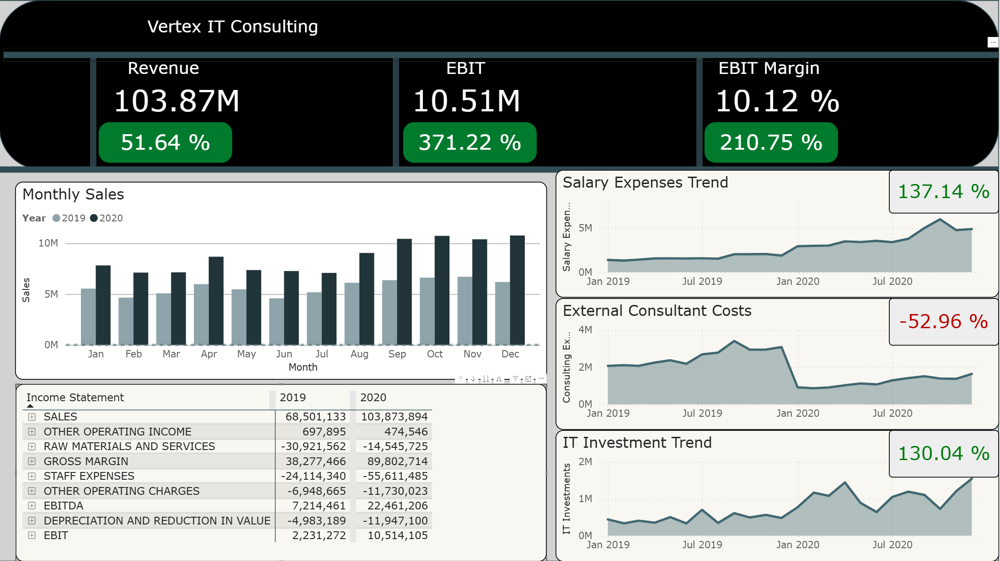

# Financial Performance Dashboard (Power BI)

Executive-level financial dashboard built in Power BI for a fictional IT consulting company.

## Overview

The dashboard analyzes financial performance between 2019 and 2020, focusing on:

- Revenue growth
- EBIT and EBIT margin development
- Cost structure evolution
- Impact of reducing external consultants
- Growth in salary expenses and IT investments

## Key Results

- Revenue increased by 51.6%
- EBIT increased by 371%
- EBIT margin improved from 3.3% to 10.1%

## Dashboard Preview

